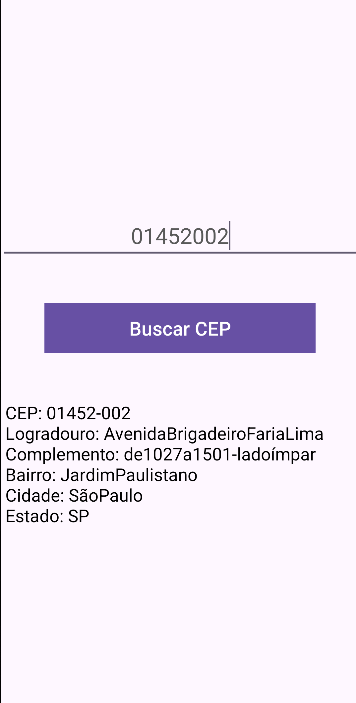

# 📮 Busca CEP

**Um aplicativo Android que, ao receber um CEP, exibe dados completos do endereço como logradouro, número, bairro, complemento, cidade e estado.**

[➡️ Baixe o APK no GitHub releases!]

---

## 📝 Sobre o projeto

**Busca CEP** é um app desenvolvido para facilitar a consulta rápida e prática de endereços a partir do CEP.  
O aplicativo foi criado em Java no Android Studio, pensado para uso simples e objetivo.

---

## 🚀 Funcionalidades principais

✅ Consulta de CEP com retorno detalhado dos dados do endereço  
✅ Interface simples e fácil de usar  
✅ Respostas rápidas via requisições HTTP  
✅ Armazenamento local do histórico das buscas (se implementar futuramente)  

---

## 🛠️ Tecnologias utilizadas

    

---

## 🌐 Como acessar

O aplicativo será disponibilizado em formato APK no GitHub releases para instalação manual.

**Dica**: Habilite a instalação de fontes desconhecidas no seu dispositivo para conseguir instalar o APK.

---

## 👨‍💻 Desenvolvedor

- Gustavo Mandu Ferreira Matori

---

## 🎓 Projeto acadêmico

Desenvolvido como atividade acadêmica solicitada pela **Fundação Bradesco**.

---

## 📷 Imagens

---

## 📄 Licença

Este projeto foi desenvolvido com fins **educacionais** e de **demonstração**.
